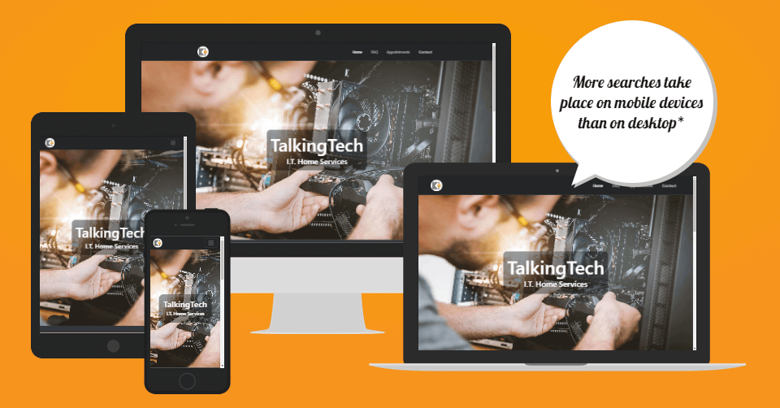

# TalkingTech

# Introduction

The TalkingTech website was built with a clear purpose in mind. It is a platform that offers a range of IT consultancy services while also featuring an innovative appointment scheduling application. This README will provide you with insights into the website's primary objectives and features.

This project serves two core objectives:

1. **Online Presence**: The website establishes an online presence for TalkingTech, enabling it to reach and assist a wider audience. It acts as a central hub for services and information.
2. **Appointment Scheduling Application**: In addition to providing information, the website incorporates a user-friendly web scheduling application. This application is designed to streamline the appointment booking process, with an emphasis on commitment and convenience for clients.

The scheduling application includes several features to enhance the user experience and minimise last-minute cancellations:

- **Deposit System**: Clients can be required to make a deposit when booking appointments. This deposit can be refunded or applied towards the service fee upon completion of the appointment, ensuring commitment.
- **Appointment Booking**: Clients can browse the consultant's availability, select suitable time slots, and submit their appointment requests through an intuitive interface.
- **Automated Appointment Reminders**: To reduce last-minute cancellations, the system sends automated reminders to clients via email, keeping them well-informed about upcoming appointments.

The website can be accessed [here](https://sasantazayoni.github.io/TalkingTech).

