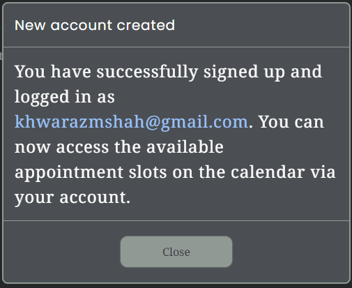

# TalkingTech

# Introduction

The TalkingTech website was built with a clear purpose in mind. It is a platform that offers a range of IT consultancy services while also featuring an innovative appointment scheduling application. This README will provide you with insights into the website's primary objectives and features.

This project serves two core objectives:

1. **Online Presence**: The website establishes an online presence for TalkingTech, enabling it to reach and assist a wider audience. It acts as a central hub for services and information.
2. **Appointment Scheduling Application**: In addition to providing information, the website incorporates a user-friendly web scheduling application. This application is designed to streamline the appointment booking process, with an emphasis on commitment and convenience for clients.

The scheduling application includes several features to enhance the user experience and minimise last-minute cancellations:

- **Deposit System**: Clients can be required to make a deposit when booking appointments. This deposit can be refunded or applied towards the service fee upon completion of the appointment, ensuring commitment.
- **Appointment Booking**: Clients can browse the consultant's availability, select suitable time slots, and submit their appointment requests through an intuitive interface.
- **Automated Appointment Reminders**: To reduce last-minute cancellations, the system sends automated reminders to clients via email, keeping them well-informed about upcoming appointments.

The website can be accessed [here](https://sasantazayoni.github.io/TalkingTech).

# User experience (UX)

## User stories

* As a new visitor, I want to easily understand the services offered by TalkingTech, so I can quickly determine if it meets my needs.
* As a potential client, I want to be able to browse through the list of services provided and access detailed information about each service, so I can make an informed decision.
* As a user of the appointment scheduling application, I want a user-friendly and intuitive interface to make the process of booking appointments straightforward and efficient.
* As a client who has booked an appointment, I want to receive confirmation of my booking and automated appointment reminders via email to ensure that I am well-informed about my scheduled appointments and have details about what to expect during the appointment.
* As a user looking for tech support, I want to access a comprehensive FAQ section to find answers to common tech-related questions.
* As a user, I want to be able to use a contact form or find contact details to reach out for enquiries or support.

## Colour scheme

* #2D2F34 (Dark Gray/Charcoal):
Professionalism: Dark gray is often associated with professionalism and formality. It can convey a sense of trust and expertise, which is essential for an IT consultancy service. It's a versatile and neutral color that complements other elements on the website.

* #33363B (Slightly Lighter Gray):
Readability: A slightly lighter shade of gray is used for text and content backgrounds. This color provides a good contrast against the darker background, making text and information easy to read. It ensures that the content is visually accessible and legible.

* #909994 (Light Gray/Steel Blue):
Accent and Variation: Light gray with a hint of steel blue is used to introduce variation and break the monotony of the darker colors. It adds a touch of modernity to the design and can be used for buttons, icons, or other interactive elements, making them stand out while maintaining a professional look.

* #4B4F53 (Dark Gray/Charcoal):
Versatility and Depth: #4B4F53 serves as a versatile backdrop for various elements on the website. From carousel tabs to modals and forms, this dark gray exudes a sense of depth and reliability. Its neutral and unobtrusive nature allows other elements to take the spotlight, creating a harmonious user experience.

* #FFF (White):
Clarity and Focus: The use of #FFF, or pure white, ensures clarity and focus on the website. As the color of text, highlighted tabs, and boxes, white provides a stark contrast against the dark gray background. This contrast enhances readability, directs attention to important elements, and conveys an air of transparency and purity, aligning perfectly with the goals of an IT consultancy service.

## Typography

Font Pair: Poppins (Sans-serif) and Noto Serif (Serif)

Poppins, a sans-serif font with a modern, clean appearance, is suitable for headings and other prominent elements. Noto Serif, a versatile serif font, offers a traditional touch to body text, ensuring excellent readability. This combination blends modernity with a timeless feel, making it suitable for an IT consultancy website.

## Imagery

By integrating carefully selected images, the overall user experience is enhanced and crucial messages are conveyed. Images can visually represent TalkingTech's expertise, professionalism and commitment to service. The images not only make the website visually engaging but also help visitors to connect with the brand on a personal level. Effective imagery is a powerful tool that can communicate complex ideas and evoke emotions, ensuring that the message and the essence of the IT consultancy services resonate with its audience. In a digital world, where first impressions matter, imagery adds depth and relatability to the online presence, making it an integral part of the website's success.

# Wireframes

All Wireframes were designed for larger screens such as laptops or computers; for medium sized screens such as tablets or large phones; and for small screens down to the smallest phone display. The wireframes can be viewed here:

* Home page and home page mobile respectively:  

   

* Services page and services page mobile respectively:  

   

* FAQ page and FAQ page mobile respectively:  

   

* Contact page and contact page mobile respectively:  

   

The wireframes do not fully correspond with the end product due to multiple changes made throughout the production phase.

# Features

## Current features

* All pages are designed using Responsive Design and are fully responsive on all devices.
* The navigation menu collapses on smaller viewports allowing for a more compact view.
* Company logo:  

  

* A navbar menu with an active state (white) and hover effect:  

  

* A hamburger menu toggler with a drop-down for smaller screens:  

  

* A carousel displaying all services with an animated border on the home page. The carousel also can be manually toggled and has tabs that open up a modal to give more details about a particular service:  

   

* Buttons with a hover effect that lightens the button:  

  

* A testimonials slider on the home page:  

  

* A pulsing arrow to scroll to the top of the page on every page:  

  

* Question tabs with drop-down answers on the FAQ page:  

  

* A sign up form, which stores user data and authentication on cloud Firestore, on the appointments page:  

  

* A modal which appears when a user signs up:  

  

* A login modal which is accessed through the "login" buttons on the appointments page:  

  

* A different user interface when logged in on the appointments page:  

  

* An embedded web scheduling application (Calendly) to book new appointments on the appointments page:  

  

* An enquiries form on the contact page:  

  

## Future features

* Implementing an AI-powered chatbot to handle basic customer inquiries and provide responses to straightforward questions.
* Incorporating a customer feedback and review system that empowers clients to share their opinions and rate the quality of services received. Positive reviews contribute to building credibility and trust, while constructive feedback serves as a valuable resource for service enhancement.
* Google Geocoding API to verify that user addresses are real.
* Google Distance API to plan journeys when seeing multiple customers in a day.

# Technologies used

## Languages

* HTML
* CSS
* JavaScript

## Frameworks, libraries and programs used

* [Font Awesome](https://fontawesome.com/) used for icons.
* [Coolors](https://coolors.co/) used to display colour palette used on the website.
* [Google Fonts](https://fonts.google.com/) used to import 'Poppins' and 'Noto Serif' fonts.
* [Github](https://github.com/) used to host repository.
* [VSCode](https://code.visualstudio.com/) used as an integrated development environment (IDE) to develop project.
* [Github pages](https://pages.github.com/) used to deploy the website.
* [Lighthouse](https://developer.chrome.com/docs/lighthouse/overview/) used for performance review.
* [Caniuse](https://caniuse.com/) used to check compatibility of code syntax with other browsers.
* [Amiresposive](https://amiresponsive.co.uk/) used to display website on the most common devices.
* [Photoshop](https://www.adobe.com/uk/products/photoshop/) used to resize photos.
* [Tinypng](https://tinypng.com/) used to compress image files for better performance.
* [Block-element-modifier naming convention](https://www.geeksforgeeks.org/understanding-the-css-bem-convention/) used for naming CSS classes.
* [AOS animations](https://github.com/michalsnik/aos) is a library used to offer dynamic JavaScript-based animations that can be utilised to create captivating visual effects, including smooth fade-ins and delightful flipping transitions throughout the website.
* [Formspree](https://formspree.io/) used in the enquiries form to provide a backend, enabling efficient routing of email enquiries directly to the business owner.
* [ChatGPT](https://chat.openai.com/) used to generate placeholder text and to verify code.
* [Unsplash](https://unsplash.com/) used to obtain pictures.
* [Pexels](https://www.pexels.com/) used to obtain pictures.
* [Shutterstock](https://www.shutterstock.com/) used to obtain pictures.
* [StackOverflow](https://stackoverflow.com/) used to problem solve and deal with queries.
* [Cloudconvert](https://cloudconvert.com/) used to convert images to webp format.
* [Favicon.io](https://favicon.io/) used to generate favicon.
* [Bootstrap](https://getbootstrap.com/) used for standard styling convention and break points.
* [Firebase](https://firebase.google.com/) used for Firestore, to store user data and Authentication to store user credentials.
* [Webpack](https://webpack.js.org/) used as a module bundler.
* [Responsinator](http://www.responsinator.com/) used to check if site was responsive on different screen sizes.

# Testing

## Validating

* [HTML validator](https://validator.w3.org/)
* [CSS validator](https://jigsaw.w3.org/css-validator/)
* [JavaScript validator](https://jshint.com/)

## Testing User Stories from (UX) section

* As a new visitor, I want to easily understand the services offered by TalkingTech, so I can quickly determine if it meets my needs.
  * The website's Home page prominently displays a carousel with tabs that showcase various IT consultancy services. Visitors can easily browse through these services to get a quick overview. Additionally when clicked, each tab opens modal that provides detailed information about each service, helping new visitors make informed decisions.
* As a potential client, I want to be able to browse through the list of services provided and access detailed information about each service, so I can make an informed decision.
  * Each tab on the carousel can be clicked to open a modal. The modals offer more information about each service.
* As a user of the appointment scheduling application, I want a user-friendly and intuitive interface to make the process of booking appointments straightforward and efficient.
  * The website features an appointment scheduling system with a user-friendly interface which becomes available when a user is logged in. Clients can easily browse the consultant's availability, select suitable time slots, and submit their appointment requests through an intuitive process. The inclusion of a deposit system and automated appointment reminders enhances the commitment and convenience of this process.
* As a client who has booked an appointment, I want to receive confirmation of my booking and automated appointment reminders via email to ensure that I am well-informed about my scheduled appointments and have details about what to expect during the appointment.
  * The appointment scheduling system provides confirmation of bookings, and automated appointment reminders are sent to clients via email. This ensures that clients are well-informed about their upcoming appointments and have all the necessary information.
* As a user looking for tech support, I want to access a comprehensive FAQ section to find answers to common tech-related questions.
  * The website offers a dedicated "FAQ" page where users can find answers to common tech-related questions. This section is designed to provide quick and helpful responses to users seeking tech support.
* As a user, I want to be able to use a contact form or find contact details to reach out for enquiries or support.
  * The "Contact" page provides a contact form, making it easy for users to reach out for enquiries or support.

## Personal testing

* Samsung Galaxy S9
  * Google Chrome
  * Mozilla Firefox
  * Microsoft Edge
  * Samsung Internet
* iPhone 6
  * Safari
* iPhone SE
  * Safari
  * Google Chrome
* iPhone 12 Mini
  * Safari
* iPhone 14
  * Safari
* iPad 11" Pro
  * Safari
* Aorus 7
  * Google Chrome
  * Mozilla Firefox
  * Microsoft Edge
  * Opera
  * Brave

## Responsinator

When there were browsers that were inaccessible at the time of testing, responsinator was used to make sure that the website was fully responsive on all devices. The results can be viewed for the following:

[Home page](http://www.responsinator.com/?url=https%3A%2F%2Fsasantazayoni.github.io%2FTalkingTech%2Findex.html)  
[FAQ page](http://www.responsinator.com/?url=https%3A%2F%2Fsasantazayoni.github.io%2FTalkingTech%2Ffaq.html)  
[Appointments page](http://www.responsinator.com/?url=https%3A%2F%2Fsasantazayoni.github.io%2FTalkingTech%2Fappointments.html)  
[Contact page](http://www.responsinator.com/?url=https%3A%2F%2Fsasantazayoni.github.io%2FTalkingTech%2Fcontact.html)  

## Lighthouse testing

The Lighthouse testing results for the TalkingTech website reflect a commendable performance in several key areas. With a perfect score of 100 in SEO, the website is well-optimized for search engines, ensuring that users can easily find and access its valuable content. The high scores in best practices (91) and accessibility (95) highlight the website's commitment to adhering to industry standards and ensuring inclusivity for all users. However, the performance score (74) reveals an area for improvement. This rating is primarily affected by the image quality, which can lead to slower loading times when images are resized. Enhancing the image optimization will contribute to a more responsive and efficient user experience, further elevating the overall quality of the website. Unfortunately it was difficult to come across high quality images that were specifically required for particular services offered by TalkingTech therefore some lower quality images had to be used.

## Bugs

* The "@property" is not compatible with Mozilla Firefox on Android phones and displays an error in the CSS validation. When the property is not recognised by a browser, the carousel just stops animating and the page functions as normal. This property is a newer one and is still recognised by nearly all browsers:  

# Deployment

For Firebase:

1. Go to the [Firebase console](https://firebase.google.com/products-build) provided by Google.
2. Click "Add project" and then name your project and continue.
3. Disable Google analytics and continue to create the project.
4. When the project is created, continue to the dashboard.
5. Click on web app indicated by "</>", name the application then click "Register".
6. Type "npm install firebase" in your IDE command line interface to install Firebase (MUST HAVE NODE.JS INSTALLED).
7. Copy the provided code and paste it into your JavaScript file where your coding for the database will take place.
8. This will connect your project to your application.
9. Initialise the app with "initializeApp(firebaseConfig)".

For deployment of the website:

1. Log into [GitHub](https://github.com/).
2. Locate the [repository](https://github.com/SasanTazayoni/Rock-paper-scissors-lizard-spock-game-CI-PP2).
3. Locate the settings option along the options bar at the top of the page.
4. Locate the 'Pages' option on the left side bar and click on it.
5. Under the 'Branch' subheading there should be a drop-down menu - select 'Master' from the branch options.
6. Click the save button.
7. Github pages will build your website with the code supplied and begin hosting it when it is completed - the process usually takes a few minutes.
8. The website URL will now be visible on the green bar under the section header. This will remain there permanently and you can refer back to it at any time.

# Credits

* Thanks to [Kevin Powell](https://www.youtube.com/@KevinPowell) for advanced CSS tips.
* Thanks to [Don Hansen](https://www.youtube.com/@DonTheDeveloper) for recommendation of the tech required to build this project.
* Thanks to [Net Ninja](https://www.youtube.com/@NetNinja) for a [tutorial](https://www.youtube.com/watch?v=9zdvmgGsww0&list=PL4cUxeGkcC9jERUGvbudErNCeSZHWUVlb&index=1) on Firebase.
