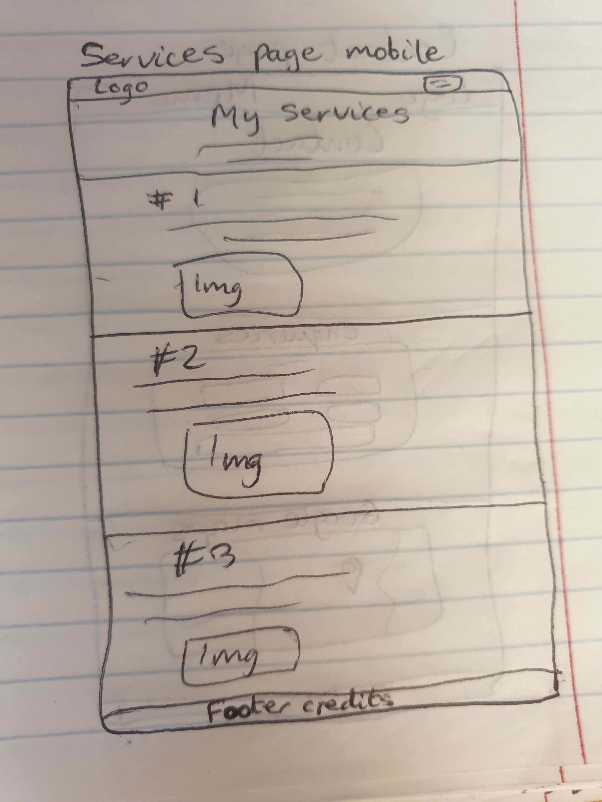
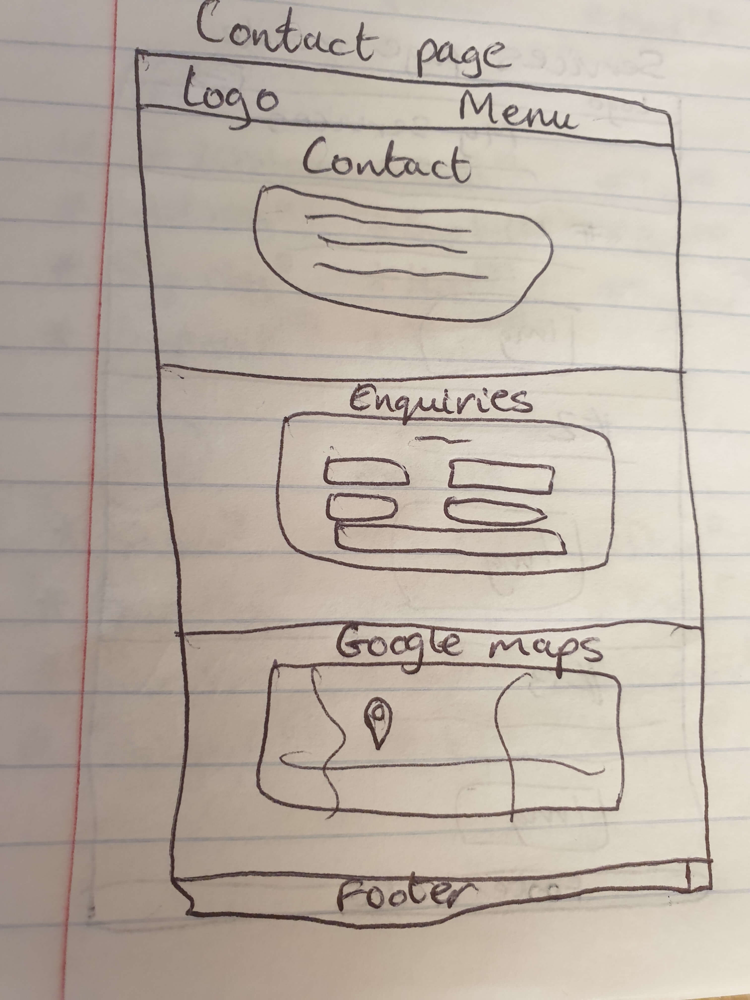
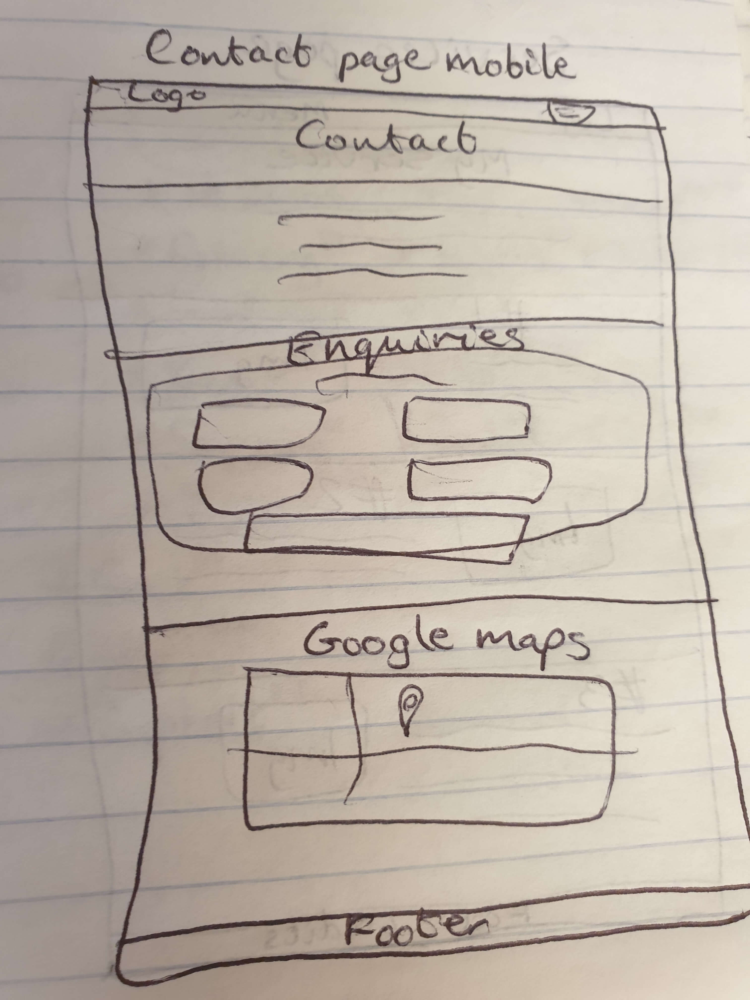

# TalkingTech

# Introduction

The TalkingTech website was built with a clear purpose in mind. It is a platform that offers a range of IT consultancy services while also featuring an innovative appointment scheduling application. This README will provide you with insights into the website's primary objectives and features.

This project serves two core objectives:

1. **Online Presence**: The website establishes an online presence for TalkingTech, enabling it to reach and assist a wider audience. It acts as a central hub for services and information.
2. **Appointment Scheduling Application**: In addition to providing information, the website incorporates a user-friendly web scheduling application. This application is designed to streamline the appointment booking process, with an emphasis on commitment and convenience for clients.

The scheduling application includes several features to enhance the user experience and minimise last-minute cancellations:

- **Deposit System**: Clients can be required to make a deposit when booking appointments. This deposit can be refunded or applied towards the service fee upon completion of the appointment, ensuring commitment.
- **Appointment Booking**: Clients can browse the consultant's availability, select suitable time slots, and submit their appointment requests through an intuitive interface.
- **Automated Appointment Reminders**: To reduce last-minute cancellations, the system sends automated reminders to clients via email, keeping them well-informed about upcoming appointments.

The website can be accessed [here](https://sasantazayoni.github.io/TalkingTech).

# User experience (UX)

## User stories

* As a new visitor, I want to easily understand the services offered by TalkingTech, so I can quickly determine if it meets my needs.
* As a potential client, I want to be able to browse through the list of services provided and access detailed information about each service, so I can make an informed decision.
* As a user of the appointment scheduling application, I want a user-friendly and intuitive interface to make the process of booking appointments straightforward and efficient.
* As a client who has booked an appointment, I want to receive confirmation of my booking and automated appointment reminders via email and text messages to ensure that I am well-informed about my scheduled appointments and have details about what to expect during the appointment.
* As a user looking for tech support, I want to access a comprehensive FAQ section to find answers to common tech-related questions.
* As a user, I want to be able to use a contact form or find contact details to reach out for enquiries or support.

## Colour scheme

* #2D2F34 (Dark Gray/Charcoal):
Professionalism: Dark gray is often associated with professionalism and formality. It can convey a sense of trust and expertise, which is essential for an IT consultancy service. It's a versatile and neutral color that complements other elements on the website.

* #33363B (Slightly Lighter Gray):
Readability: A slightly lighter shade of gray is used for text and content backgrounds. This color provides a good contrast against the darker background, making text and information easy to read. It ensures that the content is visually accessible and legible.

* #909994 (Light Gray/Steel Blue):
Accent and Variation: Light gray with a hint of steel blue is used to introduce variation and break the monotony of the darker colors. It adds a touch of modernity to the design and can be used for buttons, icons, or other interactive elements, making them stand out while maintaining a professional look.

* #4B4F53 (Dark Gray/Charcoal):
Versatility and Depth: #4B4F53 serves as a versatile backdrop for various elements on the website. From carousel tabs to modals and forms, this dark gray exudes a sense of depth and reliability. Its neutral and unobtrusive nature allows other elements to take the spotlight, creating a harmonious user experience.

* #FFF (White):
Clarity and Focus: The use of #FFF, or pure white, ensures clarity and focus on the website. As the color of text, highlighted tabs, and boxes, white provides a stark contrast against the dark gray background. This contrast enhances readability, directs attention to important elements, and conveys an air of transparency and purity, aligning perfectly with the goals of an IT consultancy service.

## Typography

Font Pair: Poppins (Sans-serif) and Noto Serif (Serif)

Poppins, a sans-serif font with a modern, clean appearance, is suitable for headings and other prominent elements. Noto Serif, a versatile serif font, offers a traditional touch to body text, ensuring excellent readability. This combination blends modernity with a timeless feel, making it suitable for an IT consultancy website.

## Imagery

By integrating carefully selected images, the overall user experience is enhanced and crucial messages are conveyed. Images can visually represent TalkingTech's expertise, professionalism and commitment to service. The images not only make the website visually engaging but also help visitors to connect with the brand on a personal level. Effective imagery is a powerful tool that can communicate complex ideas and evoke emotions, ensuring that the message and the essence of the IT consultancy services resonate with its audience. In a digital world, where first impressions matter, imagery adds depth and relatability to the online presence, making it an integral part of the website's success.

# Wireframes

All Wireframes were designed for larger screens such as laptops or computers; for medium sized screens such as tablets or large phones; and for small screens down to the smallest phone display. The wireframes can be viewed here:

* Home page and home page mobile respectively:  

   

* Services page and services page mobile respectively:  

   

* FAQ page and FAQ page mobile respectively:  

   

* Contact page and contact page mobile respectively:  

   

The wireframes do not fully correspond with the end product due to multiple changes made throughout the production phase.

# Features

## Current features

* All pages are designed using Responsive Design and are fully responsive on all devices.
* The navigation menu collapses on smaller viewports allowing for a more compact view.
* Company logo:  

  

* A navbar menu with an active state (white) and hover effect:  

  

* A hamburger menu toggler with a drop-down for smaller screens:  

  

* A carousel displaying all services with an animated border on the home page. The carousel also can be manually toggled and has tabs that open up a modal to give more details about a particular service:  

   

* Buttons with a hover effect that lightens the button:  

  

* A testimonials slider on the home page:  

  

* A pulsing arrow to scroll to the top of the page on every page:  

  

* Question tabs with drop-down answers on the FAQ page:  

  

* A sign up form, which stores user data and authentication on cloud Firestore, on the appointments page:  

  

* A modal which appears when a user signs up:  

  

* A login modal which is accessed through the "login" buttons on the appointments page:  

  

* A different user interface when logged in on the appointments page:  

  

* An embedded web scheduling application (Calendly) to book new appointments on the appointments page:  

  

* An enquiries form on the contact page:  

  

